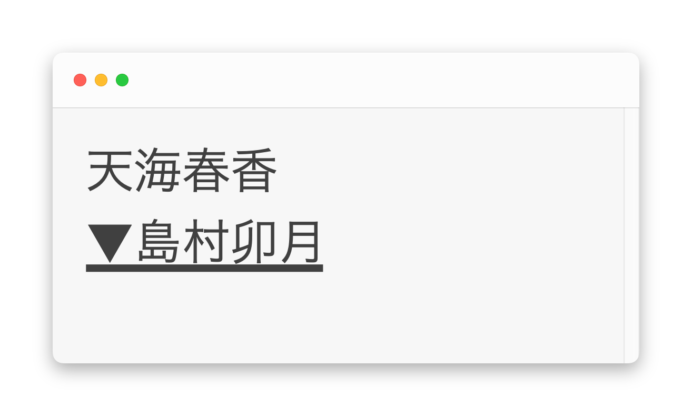
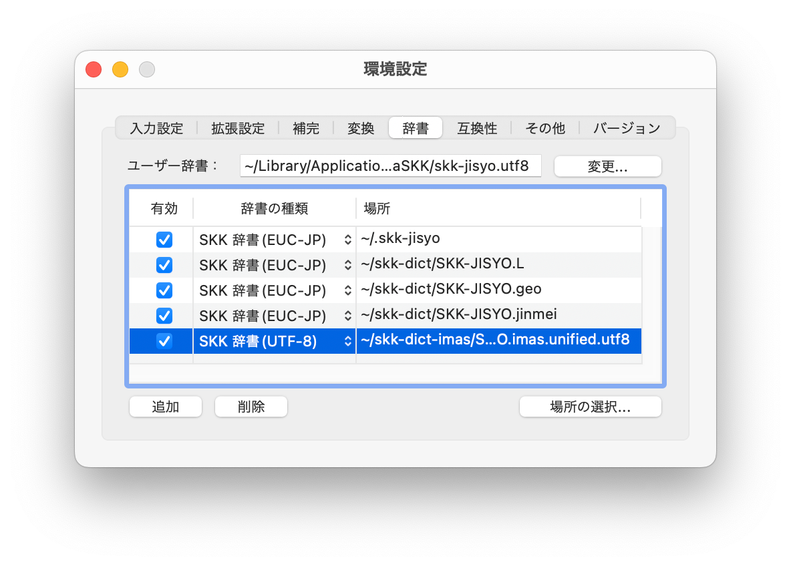

import Layout from '../components/layout'
import Helmet from '../components/helmet'

<Helmet pageTitle={ props.pageContext.frontmatter.title } />
<Layout pageTitle={ props.pageContext.frontmatter.title }>



アイドルマスターシリーズに関する語句を収録したSKK辞書です。

## リポジトリ

[https://github.com/project-brightblue/skk-dict-imas](https://github.com/project-brightblue/skk-dict-imas)

## おことわり

* いくつかの辞書はEUC版とUTF-8版に分かれています。字体の違いなどの都合によりUTF-8版のほうがより実際の表記と近いものになっているため、可能な限りUTF-8版の辞書を使ってください。
* 辞書の編集を行う際は、/srcフォルダー内にある辞書を編集して、その後にbuild.shを実行してください。(UNIX系の環境とskktoolsが必要です。Windowsをお使いの方はWSLをお使いください)

## ダウンロード

[master.zip](https://github.com/project-brightblue/skk-dict-imas/archive/master.zip)

もしくはgitがインストールされている環境で

```shell
git clone https://github.com/project-brightblue/skk-dict-imas.git
```

## 統合辞書 辞書一覧

|ファイル名                 |辞書の内容|文字コード|
|---------------------------|----------|----------|
|SKK-JISYO.imas.unified.utf8|統合辞書  |UTF-8     |
|SKK-JISYO.imas.unified.euc |統合辞書  |EUC-JP    |

## シンデレラガールズ 辞書一覧

|ファイル名                   |辞書の内容             |文字コード|
|-----------------------------|-----------------------|----------|
|SKK-JISYO.imascg.actors.euc  |声優名                 |EUC-JP    |
|SKK-JISYO.imascg.actors.utf8 |声優名                 |UTF-8     |
|SKK-JISYO.imascg.firstname   |アイドル名(下の名前)   |EUC-JP    |
|SKK-JISYO.imascg.fullname    |アイドル名(フルネーム) |EUC-JP    |
|SKK-JISYO.imascg.song.euc    |楽曲名                 |EUC-JP    |
|SKK-JISYO.imascg.song.utf8   |楽曲名                 |UTF-8     |
|SKK-JISYO.imascg.unified.euc |全部入り               |EUC-JP    |
|SKK-JISYO.imascg.unified.utf8|全部入り               |UTF-8     |

## 765プロオールスターズ / ミリオンライブ 辞書一覧

|ファイル名                     |辞書の内容             |文字コード|
|-------------------------------|-----------------------|----------|
|SKK-JISYO.imasasml.actors.euc  |声優名                 |EUC-JP    |
|SKK-JISYO.imasasml.actors.utf8 |声優名                 |UTF-8     |
|SKK-JISYO.imasasml.firstname   |アイドル名(下の名前)   |EUC-JP    |
|SKK-JISYO.imasasml.fullname    |アイドル名(フルネーム) |EUC-JP    |
|SKK-JISYO.imasasml.unified.euc |全部入り               |EUC-JP    |
|SKK-JISYO.imasasml.unified.utf8|全部入り               |UTF-8     |

## シャイニーカラーズ 辞書一覧

|ファイル名                 |辞書の内容             |文字コード|
|---------------------------|-----------------------|----------|
|SKK-JISYO.imassc.firstname |アイドル名(下の名前)   |EUC-JP    |
|SKK-JISYO.imassc.fullname  |アイドル名(フルネーム) |EUC-JP    |
|SKK-JISYO.imassc.actors    |声優名(フルネーム)     |EUC-JP    |

## つかいかた

### [SKK日本語入力FEP](http://coexe.web.fc2.com/programs.html)

付属のSKKFEP.batを実行してください。もしくは、

```
%APPDATA%\SKKFEP\DICTS
```
の下に辞書をコピーしてください。声優辞書を使用する場合はUTF-8版(SKK-JISYO.imascgss.actors.utf8)をコピーしてください。

### [AquaSKK](https://github.com/codefirst/aquaskk)



1. 設定画面を開き、辞書タブを開きます。
2. 画面左下の追加ボタンを押します。
3. 辞書の種類を`SKK 辞書(UTF-8)`にしてください。
4. git cloneした、もしくはダウンロードしてきた辞書ファイルを選択してください。

### ibus-skk

ibus-skkの設定画面を開き、辞書タブ内でダウンロードした辞書をシステム辞書として追加すると辞書が使用できるようになります。

## 主な派生物

### [skk-jisyo-imasparql](https://github.com/banjun/skk-jisyo-imasparql)

オープンデータを基にアイマスSKK辞書の自動生成を試みるプロジェクトです。この辞書のフォーマットを参考にしたそうです。  
**ユニット名の辞書が必要な方はこちらの辞書に含まれています**ので、利用をご検討ください。

## 謝辞

* [Hiroki Mizuno 様](https://github.com/mzp)
* [banjun 様](https://github.com/banjun)

辞書作成時にアドバイスを頂きました。

* [Nobuyuki Sasaki 様](https://github.com/nathancorvussolis)

SKK実装の仕様について情報提供を頂きました。

</Layout>